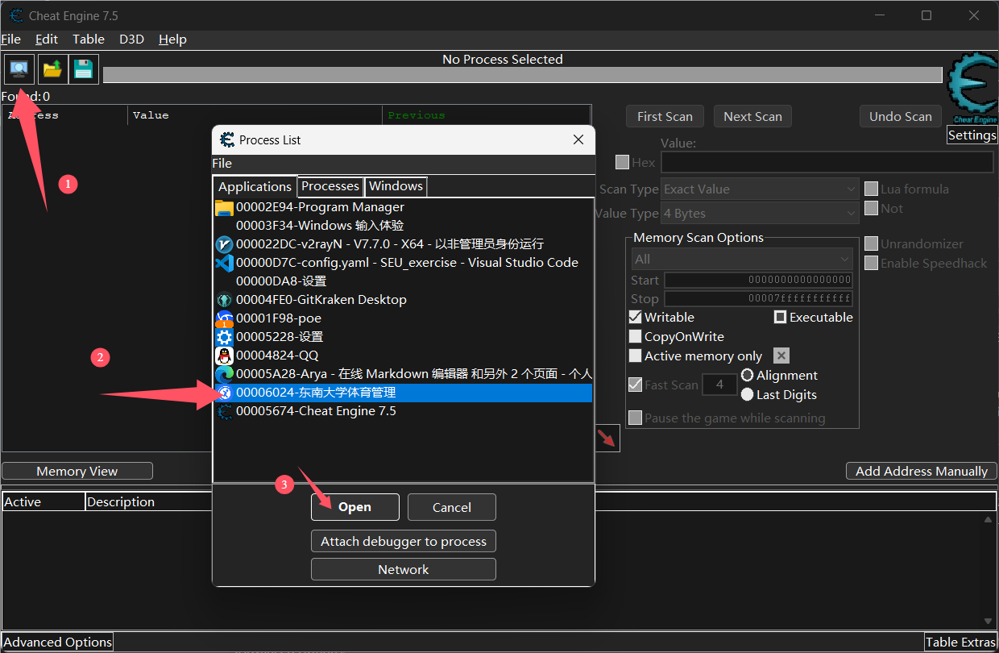
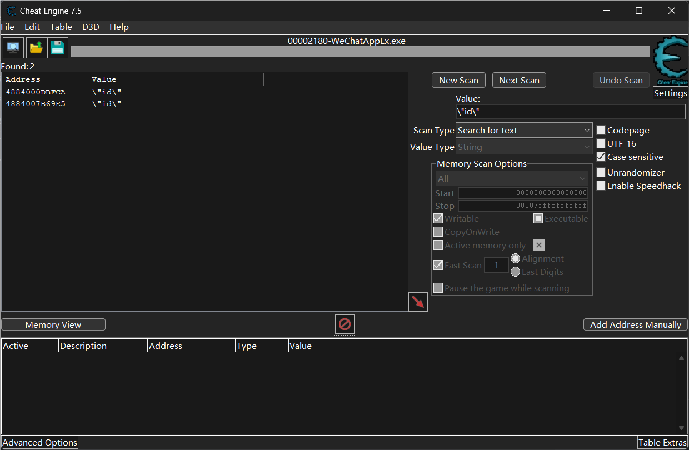
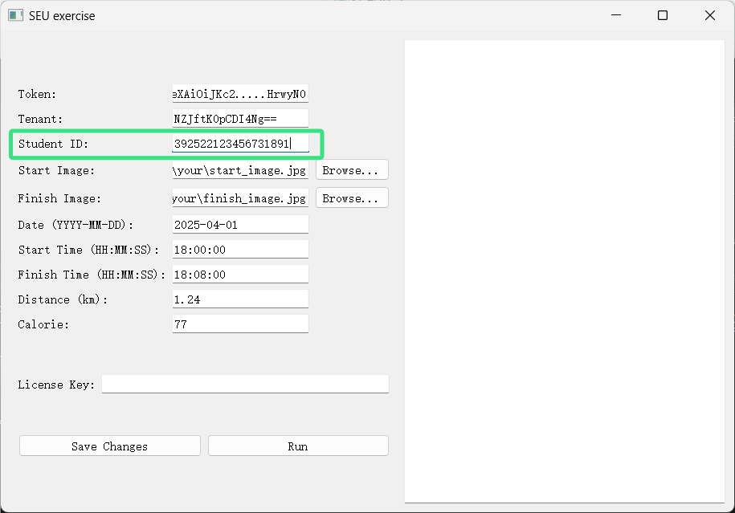

# seu_run
用于东南大学跑操小程序，仅供学习交流

参考https://github.com/el739/SEU_exercise

### 准备工作

*注意！通过校园网使用官方小程序和本软件会产生网络证书问题，因此以下操作最好均在手机个人热点+使用流量的情况下进行。*

1. 下载并安装[Cheat Engine](https://www.cheatengine.org/)
2. 打开电脑端微信
3. 运行"东南大学体育管理"小程序并登录
4. 进入"锻炼"界面，如图：
   

### 配置Cheat Engine

1. 启动Cheat Engine并跳过教程
2. 点击左上角进程选择图标，选择微信小程序进程
3. 将搜索类型改为"String"（字符串）
   
   

### 获取必要凭证的两种方法

#### 方法一：直接获取token和id

##### 1. 获取token

1. 在搜索框中输入`Bearer `（注意末尾有空格）
2. 点击"First scan"
3. 在搜索结果中选择最后一个条目
4. 按Ctrl+B打开内存查看器
5. 找到并选择`Bearer `后面的一长串无规则字符（通常包含字母、数字和符号）
6. 复制该字符串到程序的token输入框
   
   
   
   

*注：如果未能找到一串无规则字符串，请使用相同的方法查看第二个、第三个地址，直到找到token。如果所有地址均没有，则尝试打开小程序的其他页面，重复以上步骤。
token值通常只在小程序启动后1分钟内可见。如果未找到，请重启小程序重试。*

##### 2. 获取id

1. 在搜索框中输入`\"id\":\"`
2. 点击"First scan"
3. 选择搜索结果并按Ctrl+B
4. 找到约18位的数字（通常以3开头）
5. 复制该值到程序的id输入框
   
   
   

*同上，若没有找到正确的id值，则尝试重启小程序并重试。`id`一定是一串约18位的数字，实际查看时有诸多混淆项，请注意辨别。*

## 免责声明

本程序旨在为用户提供方便的锻炼记录上传功能，以促进健康意识和锻炼习惯的养成。然而，使用本程序的用户须注意以下几点：

1. **记录真实性**：本程序不对用户上传的锻炼记录的真实性与准确性负责。所有用户应对其所提交的记录负责，确保所提供的信息真实、准确，严禁任何形式的伪造或篡改。
2. **数据使用**：本程序收集的锻炼记录仅用于学校内部活动及相关统计分析，不会用于其他任何商业用途。
3. **后果自负**：用户因使用本程序而导致的任何直接或间接的损失、争议、法律责任等后果，均由用户自行承担。我们不对因用户的不当使用所引发的任何法律问题或后果负责。
4. **使用条款**：通过使用本程序，用户即表示同意遵守上述条款，并理解相关责任。我们保留随时修改本免责声明的权利，修改后的免责声明将在本程序中发布。

感谢您对本程序的支持与使用！希望您能够诚实记录锻炼信息，共同营造积极健康的校园氛围。

## 激活码获取

- 要个屁的激活码，开源！
