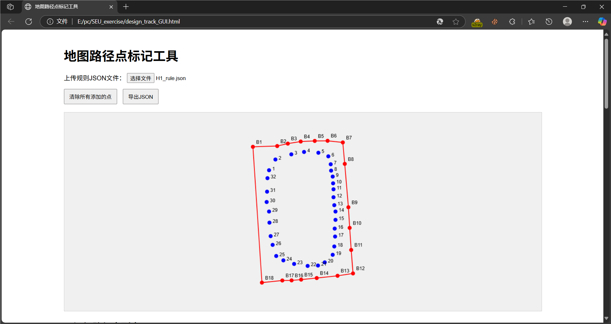
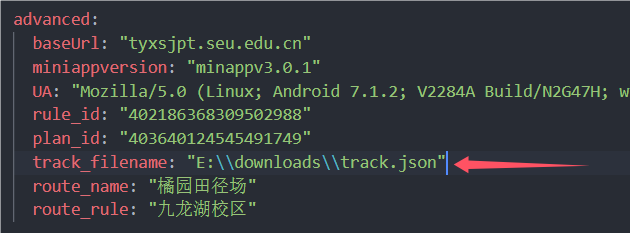

# 路线编辑工具使用文档

本项目提供了路线编辑功能，可按需使用。

## 修改运动路线教程

### 1. 启动编辑器

双击打开 `design_track_GUI.html` 文件

### 2. 加载规则文件

点击"加载文件"按钮，选择对应场地的规则文件：

| 场地名称       | 规则文件          |
|----------------|-------------------|
| 湖区橘园       | tracks/H1_rule.json |
| 湖区桃园       | tracks/H2_rule.json |
| 湖区梅园       | tracks/H3_rule.json |
| 桥区体育场     | tracks/Q_rule.json  |
| 牌区田径场     | tracks/P1_rule.json |
| 牌区体育场     | tracks/P2_rule.json |
| 无锡国际校区   | tracks/W_rule.json  |

### 3. 规划路线

在地图上点击设置路径点，这些路径点就是小程序上显示的路径点。

### 4. 导出路径文件

完成编辑后：

1. 点击"导出json"按钮
2. 系统将下载生成的运动路径文件 `track.json`

### 5. 配置文件设置

编辑 `config.yaml` 文件，将图示字段更改为导出的track.json绝对路径

## 注意事项

1. 请确保规则文件与场地匹配
2. 建议定期备份编辑好的路径文件
